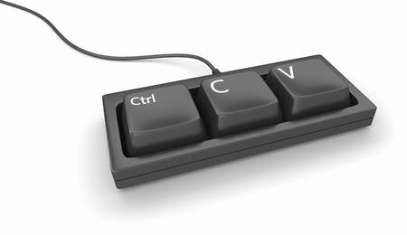

# Why decorators?

## DRY - don't repeat yourself

[The DRY principle](https://en.wikipedia.org/wiki/Don%27t_repeat_yourself)
is a programming principle, or best practice, that applies to all programming languages,
but it is certainly what being Pythonic advocates.

The idea is, whenever you start copy-pasting your code,
it is good time to stop doing it and try to extract the logic from different places,
into a single "source of truth".



Compare the following two pieces of code:

```python
def index(request):
    if request.method != 'GET':
        return HttpResponseNotAllowed('GET')

    return HttpResponse("Hello, world!")

def dashboard(request):
    if request.method != 'GET':
        return HttpResponseNotAllowed('GET')

    if request.user.is_anonymous:
        return redirect(request, reverse('login'))

    return render(request, 'dashboard.html')
```

```python
@require_GET
def index(request):
    return HttpResponse("Hello, world!")

@require_GET
@login_required
def dashboard(request):
    return render(request, 'dashboard.html')
```

Now imagine instead of two functions, we have hundreds of functions in our codebase,
which is often true for big projects.
We would need to copy the same thing over and over again, which is very error-prone.
We could miss one place where it is required, or paste it in a wrong place.

The DRY principle goes beyond just avoiding repetitive typing.
When you need to modify the logic, you can modify it in just one place,
instead of trying to find related code everywhere - and make mistakes along the way.

Of course, there are many different ways to achieve DRY.
For example, in the second snippet of dataclasses,
we could create abstract classes instead of decorators.

[Prev](../README.md) /
[Up](../README.md) /
[Next](../2-modular/README.md)
